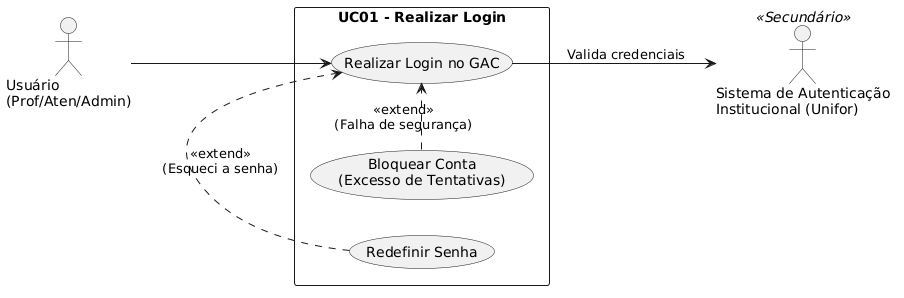
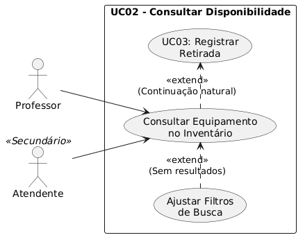
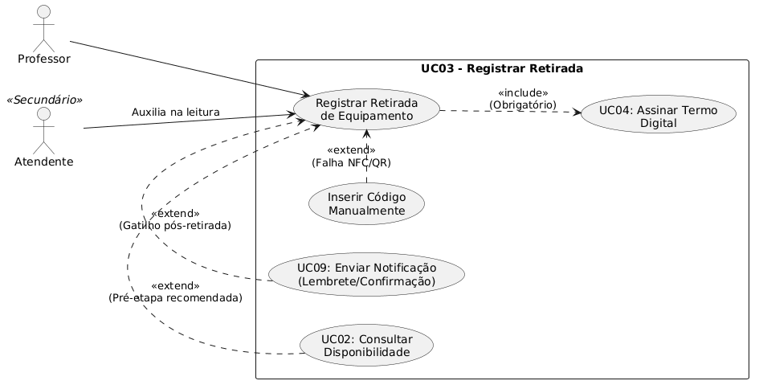
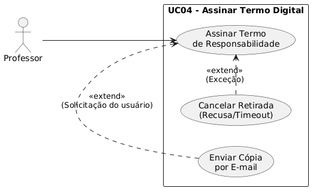
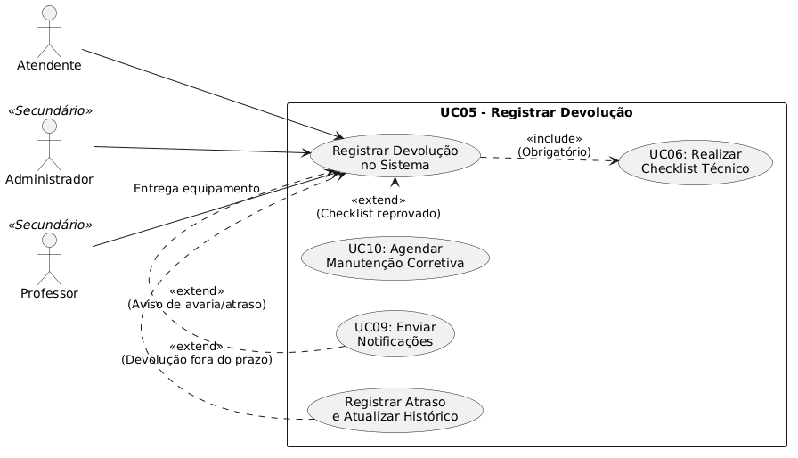
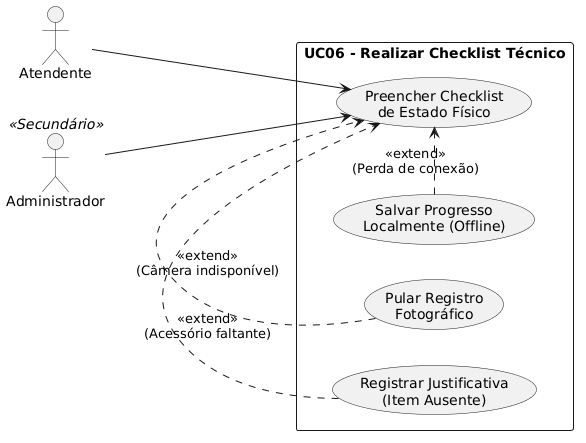
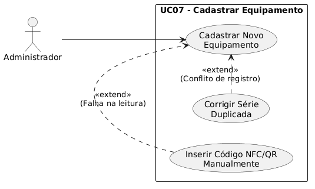
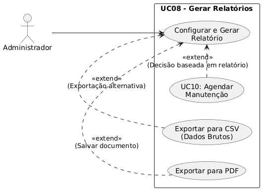
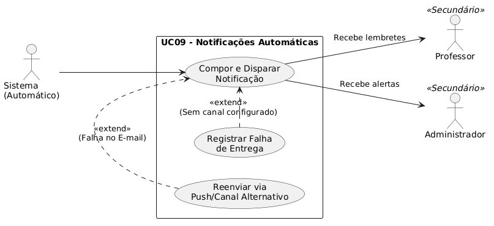
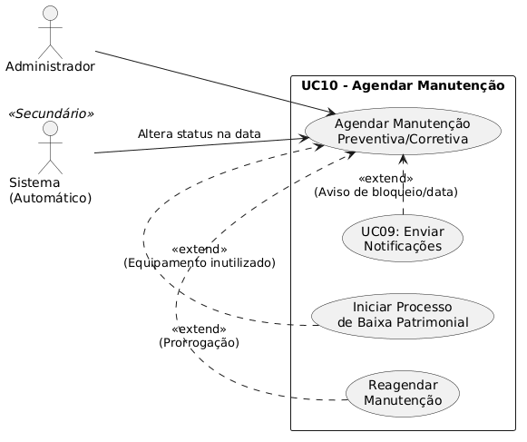

# Visão da Demanda (VD)

## Histórico de Versões

| Data         | Versão | Descrição                                                                  | Autor                                          |
| ------------ | ------- | ---------------------------------------------------------------------------- | ---------------------------------------------- |
| Maio de 2026 | 1.0     | Elaboração do Documento de Visão para a plataforma digital integrada GAC. | Disciplina: Requisitos e Modelagem de Sistemas |

## 1. Objetivo

Especificar um sistema digital integrado a identificadores físicos (NFC e/ou QR Code) para apoiar o ciclo de vida dos ativos do CCT, desde o cadastro até o relatório de uso. Este documento foi produzido no âmbito da disciplina Requisitos e Modelagem de Sistemas, como entregável de um Projeto de Extensão.

## 2. Proposta de Valor

A solução visa a substituição dos controles manuais e dispersos por um processo digital com maior rastreabilidade do inventário e das movimentações de empréstimo e devolução. Isso mitigará a dificuldade em identificar o responsável atual por um item, a ausência de registro do estado de conservação, o risco de perda ou danos sem responsabilização clara, e a sobrecarga operacional para os funcionários do CCT.

## 3. Descrição da Demanda

O CCT disponibiliza projetores, chaves e outros equipamentos para uso pelos professores durante as aulas, mas o controle de empréstimo e devolução é atualmente realizado por meio de registros manuais, comunicação verbal sem registro formal e conferência pouco padronizada. O sistema GAC (Gestão de Ativos do CCT) será uma plataforma digital composta por duas interfaces complementares: uma Interface Mobile para retiradas rápidas usando NFC ou QR Code, e uma Interface Web/Desktop para gestão centralizada, auditoria, devolução com checklist técnico e emissão de relatórios. O projeto de extensão abrange a especificação e prototipação, mas não o desenvolvimento completo do software.

## 4. Partes Interessadas

| Nome                           | Papel                     | Responsabilidades                                                         | Representante |
| ------------------------------ | ------------------------- | ------------------------------------------------------------------------- | ------------- |
| Professores do CCT             | Usuário Final            | Retirar e devolver equipamentos de forma ágil e rastreável.             | -             |
| Equipe do CCT                  | Operador / Admin          | Controlar o inventário com eficiência e reduzir retrabalho operacional. | -             |
| Coordenação                  | Gestor                    | Ter visibilidade gerencial sobre uso dos ativos e responsabilizações.   | -             |
| Direção                      | Patrocinador              | Melhorar a gestão do patrimônio e reduzir perdas.                       | -             |
| Sistemas de TI da Unifor       | Beneficiado Indiretamente | Potencial integração e unificação de dados institucionais.            | -             |
| Alunos e comunidade acadêmica | Beneficiado Indiretamente | Maior disponibilidade e confiabilidade dos equipamentos em sala.          | -             |

## 5. Personas

### 5.1. Professor do CCT

* **Descrição:** Docente que utiliza projetores, chaves e outros equipamentos durante as aulas.
* **Objetivo:** Retirar e devolver equipamentos de forma ágil e rastreável, utilizando seu smartphone com a aplicação móvel para ler NFC ou QR Code.

### 5.2. Atendente / Equipe do CCT

* **Descrição:** Funcionário responsável por apoiar as operações na recepção.
* **Objetivo:** Controlar o inventário com eficiência, reduzir a sobrecarga operacional e acessar a interface web a partir de computadores na recepção.

### 5.3. Administrador / Coordenação

* **Descrição:** Perfil de gestão responsável pelo patrimônio do CCT.
* **Objetivo:** Ter visibilidade gerencial sobre o uso dos ativos, acessar o histórico completo de movimentações, cadastrar novos equipamentos e gerar relatórios estratégicos por meio da Interface Web/Desktop.

## 6. Necessidades e Funcionalidades

### Necessidade 1: Realizar empréstimos de forma rastreável

#### F1.1 Retirada Ágil via Mobile

* **Descrição:** Identificação do equipamento por NFC ou QR Code, consulta de disponibilidade em tempo real e aceite digital do Termo de Responsabilidade pelo professor.
* **Incluída:** Sim.
* **Atores:** Professores e atendentes.
* **Frequência:** Alta.
* **Valor:** Alto (garante o registro automático da data/hora e identidade do responsável).

### Necessidade 2: Padronizar o recebimento de itens

#### F2.1 Devolução com Checklist Técnico

* **Descrição:** Conferência de acessórios e estado físico do equipamento, com registro fotográfico opcional e atualização automática de status para 'disponível'.
* **Incluída:** Sim.
* **Atores:** Administradores e coordenação.
* **Frequência:** Alta.
* **Valor:** Alto (mitiga o risco de perdas ou danos a equipamentos sem responsabilização clara).

### Necessidade 3: Administrar e controlar o patrimônio

#### F3.1 Gestão e Auditoria Centralizada e Cadastro de Inventário

* **Descrição:** Interface com visão geral do inventário, histórico completo de movimentações, cadastro detalhado de novos equipamentos (marca, modelo, série, fotos) e agendamento de manutenções preventivas.
* **Incluída:** Sim.
* **Atores:** Administradores e coordenação.
* **Frequência:** Média.
* **Valor:** Alto (melhora a gestão do patrimônio e reduz perdas).

### Necessidade 4: Monitorar prazos e métricas

#### F4.1 Alertas, Notificações Automáticas e Relatórios

* **Descrição:** Lembretes de devolução próxima ao prazo para o professor, alertas de atraso para administradores, notificações sobre manutenções e geração de relatórios estratégicos para tomada de decisão baseada em dados.
* **Incluída:** Sim.
* **Atores:** Professores, Administradores e Coordenação.
* **Frequência:** Média/Alta.
* **Valor:** Alto.

## 7. Arquitetura da Demanda

O sistema GAC (Gestão de Ativos do CCT) é composto por duas interfaces principais complementares: uma Interface Mobile destinada ao uso rápido e ágil na ponta, e uma Interface Web/Desktop destinada à gestão centralizada a partir de computadores na recepção. Além disso, a arquitetura prevê a possibilidade de integração com outros sistemas institucionais da Unifor e a comunicação com etiquetas físicas (NFC e/ou QR Code) fixadas nos equipamentos.

### 7.1. Diagramas UML

Como objetivo específico do projeto, serão criadas representações UML da estrutura e comportamento do sistema proposto, além do desenvolvimento de protótipos de interface que facilitem a experiência do usuário.

#### 7.1.1. Diagrama de Caso de Uso

* **Descrição dos casos de uso principais previstos:**
  * Login
  
  * Disponibilidade
  
  * Retirada 
  
  * Assinatura do Termo Digital
  
  * Devolução do Equipamento
  
  * Checklist Técnico
  
  * Cadastro de Equipamento
  
  * Relatórios
  
  * Notificações
  
  * Manutenção
  

#### 7.1.2. Diagrama de Componentes

* **Componentes principais previstos:**
  * Interface Mobile.
  * Interface Web/Desktop.
  * Módulo de Integração (sistemas institucionais Unifor).

#### 7.1.3. Diagrama de Implantação

* **Ambiente de execução previsto:**
  * Smartphones dos professores (acesso à aplicação móvel).
  * Computadores na recepção da equipe do CCT.
  * Rede e conectividade no ambiente do CCT.

---

## Checklist de Validação do Documento de Visão

- [ ] O objetivo está claro e alinhado ao problema/necessidade?
- [ ] A proposta de valor é mensurável e relevante?
- [ ] Todas as partes interessadas estão listadas com papéis definidos?
- [ ] Existem pelo menos duas personas descritas?
- [ ] Todas as necessidades e funcionalidades estão relacionadas a atores?
- [ ] Há indicação de valor e frequência para cada funcionalidade?
- [ ] A arquitetura está ilustrada (mesmo que de forma simples)?
- [ ] O documento está escrito em linguagem clara e objetiva?
